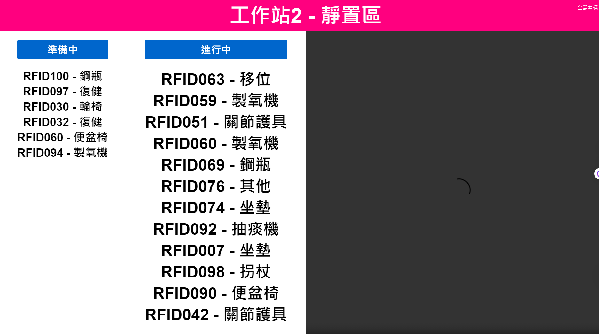

# Order Panel

這是一個簡易的RFID清消流程的網頁應用程序，包含以下功能：

- 顯示準備中和進行中的訂單
- 自動全螢幕模式
- 自動播放廣告影片
- 動態更新訂單狀態

## 文件結構

```
order-panel/
├── src/
│   ├── index.html
│   ├── scripts/
│   │   └── app.js
│   ├── styles/
│   │   └── style.css
│   └── videos/
│       └── VIDEO0091.mp4
└── README.md
```

## 使用說明

### 1. 安裝依賴

無需安裝任何依賴，這是一個純前端的應用程序。

### 2. 啟動應用

打開 `src/index.html` 文件即可在瀏覽器中查看應用。

### 3. 功能介紹

#### 自動全螢幕模式

進入網頁後，應用會在 5 秒後自動進入全螢幕模式。

#### 自動播放廣告影片

應用會自動播放位於 `src/videos/VIDEO0091.mp4` 的影片。你可以替換該影片文件以播放其他影片。

#### 動態更新訂單狀態

應用會每 5 秒隨機添加或完成一個訂單，並動態更新顯示。

### 4. 文件說明

#### `src/index.html`

主 HTML 文件，包含應用的結構和樣式。

#### `src/scripts/app.js`

主 JavaScript 文件，包含應用的邏輯和功能。

#### `src/styles/style.css`

主 CSS 文件，包含應用的樣式。

#### `src/videos/VIDEO0091.mp4`

示例影片文件，你可以替換為自己的影片。

這是一個簡單的專案介紹。

Simple 展示


